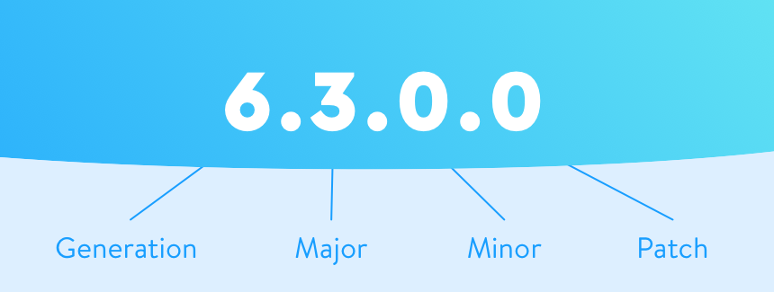

# Semantic Versioning

## Shopware 6 version number

## Shopware Plugin Versioning Scheme
- [MAJOR].[MINOR].[PATCH]
- when a new release is created, the version number is increased by 1 in the following way:
    - MAJOR: increased when there are breaking changes
    - MINOR: increased when there are new features
    - PATCH: increased when there are bug fixes 

